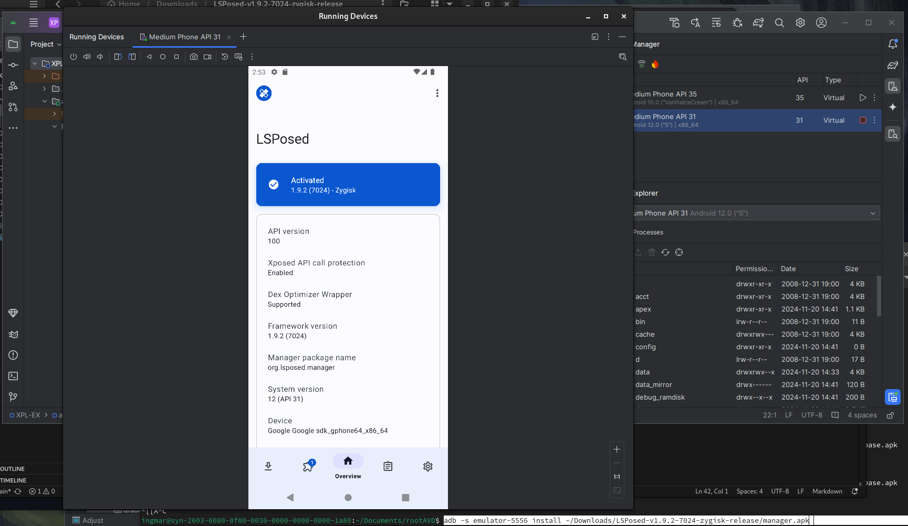

# installing s tuff on android studio emulator

First get android studio and install a couple of different AVD's in the device manager. I had success with android 12. 

Then go here: https://gitlab.com/newbit/rootAVD and follow the steps to install magisk. 

Based on this: https://xdaforums.com/t/script-rootavd-root-your-android-studio-virtual-device-emulator-with-magisk-android-linux-darwin-macos-win-google-play-store-apis.4218123/ you'll probably need to do the install script twice (i did) and then enable zygisk and restart the emulator from magisk. 


To confirm stuff worked, open up a shell and do: 
```
adb shell 
su 
```

in magisk you should be prompted to give sudo access to shell and that confirms it works. 


Next install LSPosed, but this time grab the zygisk version not riru: 
https://github.com/LSPosed/LSPosed/releases (i installed the latest one). Then do 

```
adb push /pathtolsposed
```

and then in Magisk do "install from storage" and you should find it there to install and reboot the emulator. 

After the emulator reboots if you can't find the LSPosed manager, run this command (-s just is the specific device since I have multiple now): 

```

 adb -s emulator-5556 logcat | grep LSPosed
```

if you see something like "lsposed manager not installed" you'll have to run it manually. unzip the lsposed download you got a couple steps ago and then run: 

```
adb -s emulator-5556 install ~/Downloads/LSPosed-v1.9.2-7024-zygisk-release/manager.apk
```

and you should now have lsposed manager and be set up to do the other stuff!


