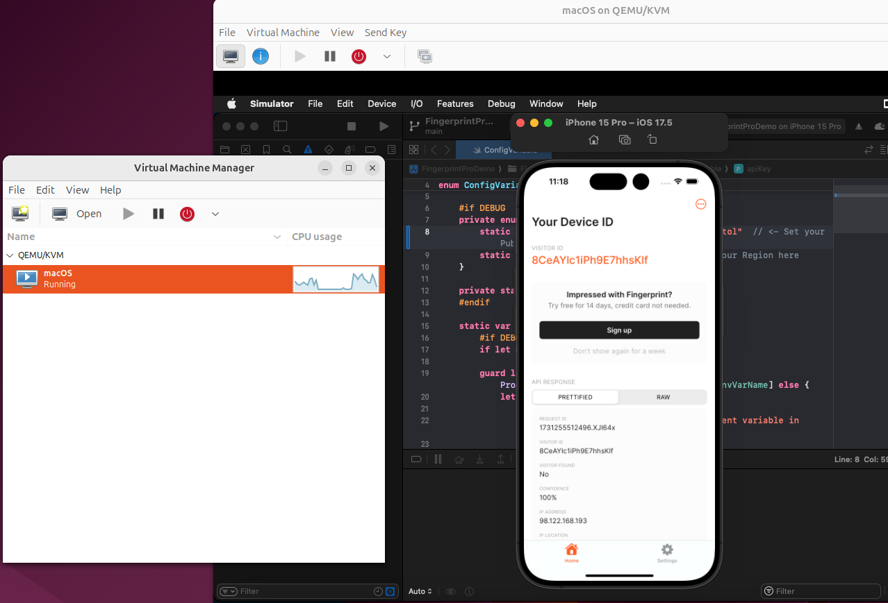

# getting ios simulator working on x86 

## getting osx in virt manager
First follow the steps in this guide: https://github.com/kholia/OSX-KVM to get OSX working with virt-manager. Use Ventura because sonoma/sequoia don't work and montery/older for some reason won't install all the dependencies.

When you first boot in, it'll give you some options. Go into disk utility and find the correct drive. It's the one with the most space and named qemuhdd or something like that. Erase it and format it to APFS, not sure if the name matters but I named it `Macintosh HD` like in this youtube video: and then installed the mac version. Then you have to go into the installer and hit enter which will install it. It's a bit finnicky, and might require a couple of reboots. When all that is done you should see `Macintosh HD` or whatever you named it and you can boot into mac from ther.

> **_NOTE:_**  This can take like 1-2 hours to fully install
## getting xcode and xcode tools 

once you're booted in, go here: https://xcodereleases.com/ and then follow the link to xcode 15.4. It's going to take a while to get the release downloaded and uncompress the xip file. When you try to open it, it will fail saying 15.4 is too new for the MACos version. 

First, do xcode-select and point it to the xcode download. Then I followed these steps: https://iosmith.com/xcode-old-macos/ to change the minimum version for both the simulator and xcode. After it opens make sure you download a new-ish version of ios simulator (i had 17.5) and wait for all of that to download and finish. Once that finishes installing, turn off the VM and increase your CPU and memory to a good value (i'm using 32 cpu and 48gb memory)

## get the fingerprint code 
clone this repo: https://github.com/fingerprintjs/fingerprint-device-intelligence-ios-demo and follow the inital steps. Instead of using `xed .` since that sporadically doesn't work just open the project in xcode manually. Make sure you create a developer account so you have an API key you can manually input into the config variable file.  Once that's done, you can hit play and it should open the simulator and you can test your fingerprint. You should see something like this: 

If you get an error about tools versioning, then the setup is not working correctly and you'll have to trace back your steps.

