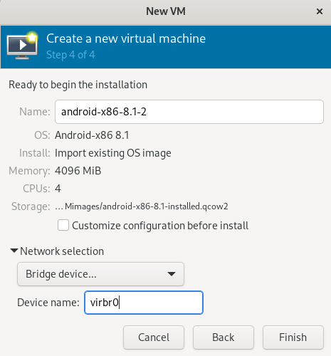

# Using pre-built vm image 

If you don't want to follow the steps in ../lsposed to install everything manually, these are the steps to get the pre configued image working with virt-manager. 

## VM Setup

### step 1 
First, get the image from here: https://drive.google.com/drive/folders/12lpG1rVkFPYY-GjhARhUHTrPX3bRthyT?usp=sharing

After that, open up `virt-manager` and do `import existing disk image`. Point it at the location of the image you just downloaded. Usually the images are in /var/lib/libvirt/images/ so it could be beneficial to put it there. 

### step 2
For operating system, choose android-x86-8.1 and go forward. 

### step 3
Allocate at least 4-8 gigs of ram and 4 cpus for it to run relatively smoothly. Then go forward again.

### step 4
In the next window, you can keep the storage location the same. For the network connection, click bridged connection and then enter `virbr0`. 

### step 5
After that you should be good to go. 

When you see things like "android not working" or "google services not working" just press do not show me again. 

## Frida + ADB Setup

### step 1
You'll need to get the android tools to do things with ADB and android studio, also download Frida (i used pip to install it). 

Links in case you don't want to find it yourself: https://developer.android.com/tools/releases/platform-tools 
https://developer.android.com/studio
https://frida.re/docs/installation/

### step 2 
Get the Ip address of the VM by navigating to view->details->nic and you should see something like below. Copy the IP for the next step 

### step3
In a terminal, run:

`adb connect <ip address of machine>` 

and you should be connected to the VM and ready to push APK's and do other stuff. 